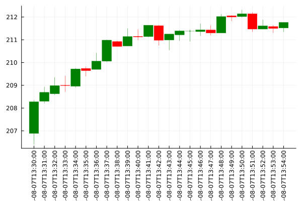
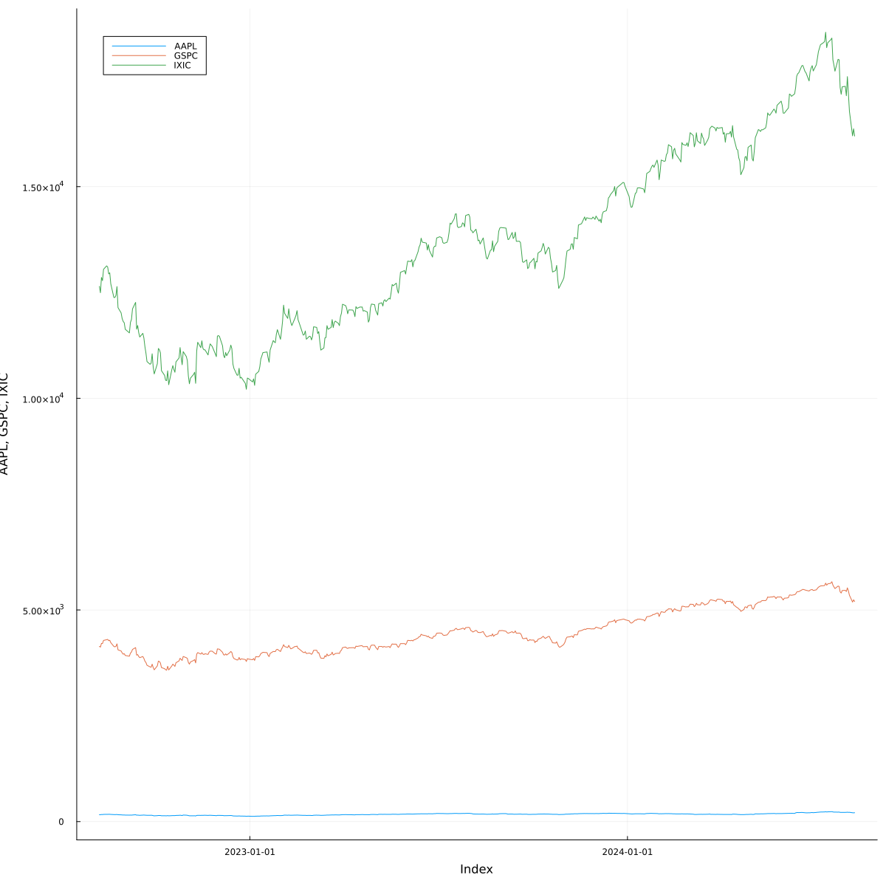

# Plotting Some Data
This section gives some examples on how to create plots for a few data items - quite a lot of data that is available is not covered here.


## Packages Used

 - *DataFrames.jl* for easier data handling
 - *TimeSeries.jl* To show interoperability with TimeArray 
 - *TSFrames.jl* To show interoperability with TSFrame
 - *Dates.jl* because we need dates 
 - *Plots.jl*
 - *StatsPlots.jl*

  
  
## Load the packages:
```julia
using YFinance
using DataFrames, Dates, Plots, StatsPlots
```
  
  
## Retriev price information for AAPL 
Here we use intraday price information.
```julia
AAPL = get_prices("AAPL",interval = "1m",range="1d")
```
  
  
# OHLC Plot (Intraday)

Here we can use the TimeSeries package. One can instead also just use the data from the dictionary, or sink into a DataFrame or a TSFrame

## The Plot:

Plotting the first 25 values.
```julia
plot( sink_prices_to(TimeArray,AAPL)[1:25] , seriestype = :candlestick)
# Alternative call:
plot(get_prices(TimeArray,"AAPL",interval = "1m",range="1d")[1:25] , seriestype = :candlestick)
```

  
  
  
# Plot Multiple Items
For illustration I used Apple (AAPL), the S&P500 (^GSPC), and the NASDAQ (^IXIC) for this.
To show the interoparability with TSFrames.jl we will sink to TSFrame in this example
  
## Download Data as a TSFrame
```julia
# Lets use TSFrames now for this example.

tickers = ["AAPL","^GSPC", "^IXIC"];
# Broadcast and sink into a TSFrame
prices =  get_prices.((TSFrame,),tickers,interval="1d",range="2y")
# get rid of the ^ in the tickers
tickers = replace.(tickers,"^"=>"");

# Get only the adjusted close and time index and join the data into one TSFrame
prices = join(getindex.(prices,:,([:Index,:adjclose],))...)
# we want to rename the adjclose to the tickers
TSFrames.rename!(prices, tickers)
```
  
## Comparsion Plot - raw prices
```julia
# Let's compare how the stocks have performed over time:
# Creates a comparison plot of the price for all items
plot(prices)
```

  
  
## Comparison Plot - Wealth Index
For better comparison we first calculate returns and afterwards a wealth index then plot that.
```julia
# First caluclate log returns.
prices = diff(log.(prices))

# next add a zero to the first missing value so the index starts at 1.
for t in tickers
    getproperty(prices, Symbol(t*"_log"))[begin] = 0.0
end

# we now need to cumulate these to get a wealth index.
for t in tickers
    getproperty(prices, Symbol(t*"_log"))[begin:end] = cumsum(getproperty(prices, Symbol(t*"_log"))[begin:end])
end

# Take the exponent again to go back to "normal returns"
prices = exp.(prices)
TSFrames.rename!(prices,tickers) # rename back to the old names without "_log" attached.
plot(prices)
```

  

# Get Fundamental Data - Example Income Statement
```julia
# Download and store in a DataFrame
is_apple = get_Fundamental("AAPL","income_statement","annual","2020-01-01","2024-12-31") |> DataFrame
# Calculate Profit Margin etc at different levels
is_apple.ProfitM = is_apple.NetIncome./is_apple.TotalRevenue;
is_apple.OperIncM = is_apple.OperatingIncome./is_apple.TotalRevenue;
is_apple.GrossProfitM = is_apple.GrossProfit./is_apple.TotalRevenue;

# Plot:
plot(is_apple.timestamp, is_apple.GrossProfitM,label = names(is_apple)[2], seriestype = :bar, legend=true)
plot!(is_apple.timestamp, is_apple.OperIncM,label = names(is_apple)[3], seriestype = :bar)
plot!(is_apple.timestamp, is_apple.ProfitM,label = names(is_apple)[4], seriestype = :bar)
```


# ESG Data Bar Chart
Bar Chart comparing ESG scores between AAPL and its peers

Download ESG data and convert to a DataFrame and reshape to long format for easier plotting
```julia
esg = get_ESG("AAPL")
esg = vcat([DataFrame(i) for i in values(esg)]...) #convert to DataFrame
subset!(esg, :timestamp => x -> isequal.(x,maximum(x))) # take only the newest values
esg = DataFrames.stack(esg,[:esgScore,:environmentScore,:governanceScore,:socialScore]) #reshape into long format
using StatsPlots
groupedbar(esg.variable, esg.value, group = esg.symbol, ylabel = "Scores")
```

  

  
# Pie Chart of the major Holders
  
## Downloading the Data
```julia
major_holders  = get_major_holders_breakdown("AAPL") |> DataFrame
```
  
## Creating the Pie Chart
```julia
#select the relevant fields:
select!(major_holders, r"insiders|institutionsP");
# Calculate the left over part
major_holders.Rest .= 1-sum(major_holders[1,1:2]) 
# reshape to long
major_holders=stack(major_holders); 
pie(major_holders.variable,major_holders.value)
```
